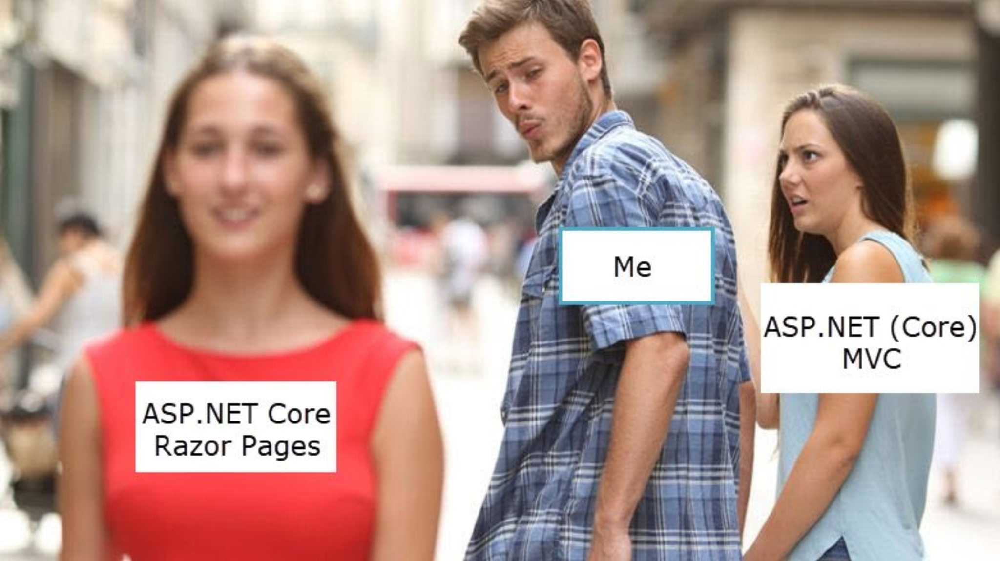

# EF-Core

Доступ к базе данных SQL для приложений .Net Core на основе EF Core  
Рещение содержит ряд учебных проектов с кодом. Проекты созданы на основе документации, на которую приводятся ссылки. Вы можете самостоятельно следовать документации, сверяясь, при необходимости с кодом нашего проекта, и некоторыми нашими комментариями.

## Начало работы с EF Core
[Создание консольного приложения EFGetStarted](https://docs.microsoft.com/ru-ru/ef/core/get-started/?tabs=visual-studio)

При копировании команд для создания базы данных, не забудьте нажать Enter, чтобы выполнить последнюю команду Update-Database  
Посмотреть содержимое БД SQLite можно с помощью [Браузер БД SQLite](https://sqlitebrowser.org/)

Учебный проект `EFGetStarted`

## [EF Core с Razor Pages →](doc/EF-Core-Razor-Pages.md)
[Учебник Razor Pages с Entity Framework Core в ASP.NET Core](https://docs.microsoft.com/ru-ru/aspnet/core/data/ef-rp/intro?view=aspnetcore-3.1&tabs=visual-studio)

База данных создается в стандартном каталоге `C:/Users/{user}` . Для доступа к БД (просмотр, удаление) можно использовать SQL Server Management Studio (SSMS) - при подключении выбрать (localdb)\MSSQLLocalDB

Учебный проект `ContosoUniversity`

## Razor Pages или MVC?
Снова изменения, теперь Microsoft предлагает ✨**Razor Pages**✨ в качестве ведущей платформы веб разработки для ASP.NET Core. Что это.., возврат к WebForms? - но здесь нет тега Form для всей страницы, нет и фарша из ViewState, нет и событий.  
Зато есть все, что используется в MVC, кроме контроллеров, да и адресация url теперь зависит от положения страницы. Получается, что это скорее MVC без контроллеров.  
🔖 Почитайте дискуссии на эту тему:  
• [ASP.NET Core Razor Pages против MVC: что создаст лучшие веб-приложения ](https://hackernoon.com/asp-net-core-razor-pages-vs-mvc-which-will-create-better-web-apps-in-2018-bd137ae0acaa)  
• [Razor Pages vs. MVC - чем отличаются](https://exceptionnotfound.net/razor-pages-how-does-it-differ-from-mvc-in-asp-net-core/)  
• [Razor Pages против приложений MVC | Форумы ASP.NET](https://forums.asp.net/t/2163056.aspx?Razor+Pages+Vs+MVC+apps)

  

Стоит присмотрется!

## [EF Core с MVC →](doc/EF-Core-MVC.md)
Учебный проект `ContosoUniversityMVC` по работе с ASP.NET Core MVC и EF Core 3.1  
* Реализация наследования в модели данных  
* Выполнение прямых SQL-запросов  
* Использование динамических запросов LINQ для упрощения кода  

## [EF Core Database First MVC →](doc-EF-Core-Scaffold.md)

Подключение существующей базы данным к приложения MVC c EF Core

  

  Практические консультации вы можете получить на наших <a  href="http://creativcode.ru/learn" target="_blank" >веб курсах в Сочи, Адлер</a>:  
   

