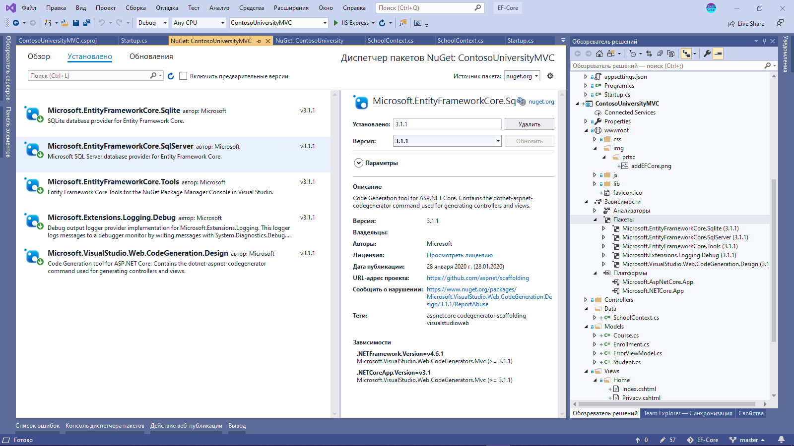

# EF-Core
Доступ к базе данных SQL для приложений .Net Core на основе EF Core

## Начало работы с EF Core
[Создание консольного приложения EFGetStarted](https://docs.microsoft.com/ru-ru/ef/core/get-started/?tabs=visual-studio)

При копировании команд для создания базы данных, не забудьте нажать Enter, чтобы выполнить последнюю команду Update-Database  
Посмотреть содержимое БД SQLite можно с помощью [Браузер БД SQLite](https://sqlitebrowser.org/)

## EF Core с Razor Pages
[Учебник Razor Pages с Entity Framework Core в ASP.NET Core](https://docs.microsoft.com/ru-ru/aspnet/core/data/ef-rp/intro?view=aspnetcore-3.1&tabs=visual-studio)

База данных создается в стандартном каталоге `C:/Users/{user}` . Для доступа к БД (просмотр, удаление) можно использовать SQL Server Management Studio (SSMS) - при подключении выбрать (localdb)\MSSQLLocalDB

## EF Core с MVC
[Учебник по работе с ASP.NET Core 2.0 MVC и EF Core](https://docs.microsoft.com/ru-ru/aspnet/core/data/ef-mvc/?view=aspnetcore-3.1)

В проекте используется Net Core 3.1, что то приходится подправить, на основе руководства по EF Core с Razor Pages.  
Классы модели данных в точности такие же, как и для Razor Pages.

При добавлении класса SchoolContext требуется добавить в приложение несколько пакетов с помощью NuGet:
ссылку на общий пакет Microsoft.EntityFrameworkCore -- не добавлять.

Добавить те же пакеты, что и в приложении `EF Core с Razor Pages`

 
    

### [Реализация функциональности CRUD](https://docs.microsoft.com/ru-ru/aspnet/core/data/ef-mvc/sort-filter-page?view=aspnetcore-3.1)
● Настройка страницы сведений: представление Details для отображения списка Enrollments;  
● Обновление страницы Create: настройка обработчика сбоев, защита от чрезмерной передачи данных;  
● Обновление страницы редактирования: настройка HttpPost Edit, защита от чрезмерной передачи данных, вариант с предварительным чтением данных. Альтернативный код метода HttpPost Edit: создание и подключение.  
● Обновление страницы удаления: обработка ошибок, изменение метода GET для отображение ошибки сохранения. Подход с предварительным чтением для метода HttpPost Delete.  
● Управление БД: закрытие подключений. Обработка транзакций: По умолчанию платформа Entity Framework реализует транзакции неявно. Если нужен дополнительный контроль, то см. в разделе [Транзакции](https://docs.microsoft.com/ru-ru/ef/core/saving/transactions).  
● Отключение отслеживания запросов: [метод `.AsNoTracking()`](https://docs.microsoft.com/ru-ru/aspnet/core/data/ef-mvc/crud?view=aspnetcore-3.1#no-tracking-queries)

### [Cортировка, фильтрация и разбиение на страницы](https://docs.microsoft.com/ru-ru/aspnet/core/data/ef-mvc/sort-filter-page?view=aspnetcore-3.1)

   

● Добавление ссылок для сортировки столбцов  
● Добавление поля поиска. [Особенности работы при наличии слоя репозитария](https://docs.microsoft.com/ru-ru/aspnet/core/data/ef-mvc/sort-filter-page?view=aspnetcore-3.1#add-a-search-box). Особенности оптимизации SQL сервера при учете регистра строк.  
● Разбиение по страницам. Учет фильтрации и сортировки при разбиении по страницам  
● Создание страницы сведений. Группировка и расчеты.

### [Функции миграций](https://docs.microsoft.com/ru-ru/aspnet/core/data/ef-mvc/migrations?view=aspnetcore-3.1)
● Создание первоначальной миграции. Чтобы избежать ошибок, воспользуйтесь командами PowerShell как в руководстве [Razor Pages EF](https://docs.microsoft.com/ru-ru/aspnet/core/data/ef-rp/migrations?view=aspnetcore-3.1&tabs=visual-studio#create-an-initial-migration). 
Первая команда `Add-Migration InitialCreate` создаст файлы миграции, в вторая `Update-Database` создаст новую БД `SchoolContext2`  
● Далее вернитесь к исходному руководству [Обзор методов Up и Down](https://docs.microsoft.com/ru-ru/aspnet/core/data/ef-mvc/migrations?view=aspnetcore-3.1#examine-up-and-down-methods). Параметр имени миграции (в примере это "InitialCreate") используется в качестве имени файла и может быть любым.
● Из Razor Pages EF: [Таблица журнала миграции в базе SQL](https://docs.microsoft.com/ru-ru/aspnet/core/data/ef-rp/migrations?view=aspnetcore-3.1&tabs=visual-studio#the-migrations-history-table), [Моментальный снимок модели данных](https://docs.microsoft.com/ru-ru/aspnet/core/data/ef-rp/migrations?view=aspnetcore-3.1&tabs=visual-studio#the-data-model-snapshot)   
● Удаление миграции. Сначала надо откатить базу до предыдущей миграции, я сделал это в PowerShell командой [Update-Database -Migration 0](https://docs.microsoft.com/ru-ru/ef/core/miscellaneous/cli/powershell#update-database) -- таблицы, созданные предыдущей миграцией, удаены из БД. Для удаления файлов миграции из проекта я выполнил команду  [Remove-Migration](https://docs.microsoft.com/ru-ru/ef/core/miscellaneous/cli/powershell#remove-migration)
